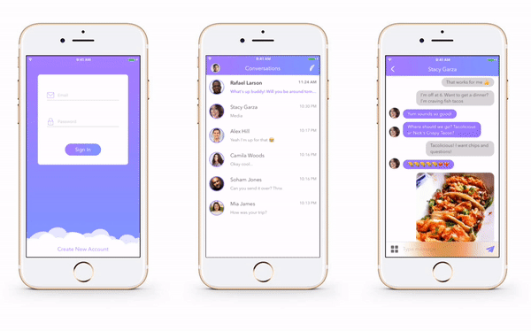

# Quick Chat for iOS

Quick Chat for iOS is a real time chat app based on Firebase developed by [Haik Aslanyan](https://twitter.com/aslanyanhaik) and written in Swift 3.

Quick Chat allows to send and receive text messages, photos & location.

## Getting Started

To get started and run the app, you need to follow these simple steps:

1. Open the QuickChat workspace in Xcode.
2. Change Bundle Identifier to match your domain.
3. Go to [Firebase](https://firebase.google.com) and create new project.
4. Select "Add Firebase to your iOS app" option, type bundle Identifier & click continue.
5. Download "GoogleService-Info.plist" file and add to project. Make sure file name is "GoogleService-Info.plist".
6. Go to [Firebase Console](https://console.firebase.google.com), select your project, choose "Authentication" from left menu, select "SIGN-IN METHOD" and enable "Email/Password" option.
6. You're all set! Run Quick Chat on your iPhone or the iOS Simulator.

## Compatibility

This project is written in Swift 3.0 and requires Xcode 8.2 to build and run.

Quick Chat for iOS is compatible with iOS 9.1+.

## Authors

* [Haik Aslanyan](https://twitter.com/aslanyanhaik)

## License

Copyright 2017 Haik Aslanyan.

Licensed under MIT License: https://opensource.org/licenses/MIT
